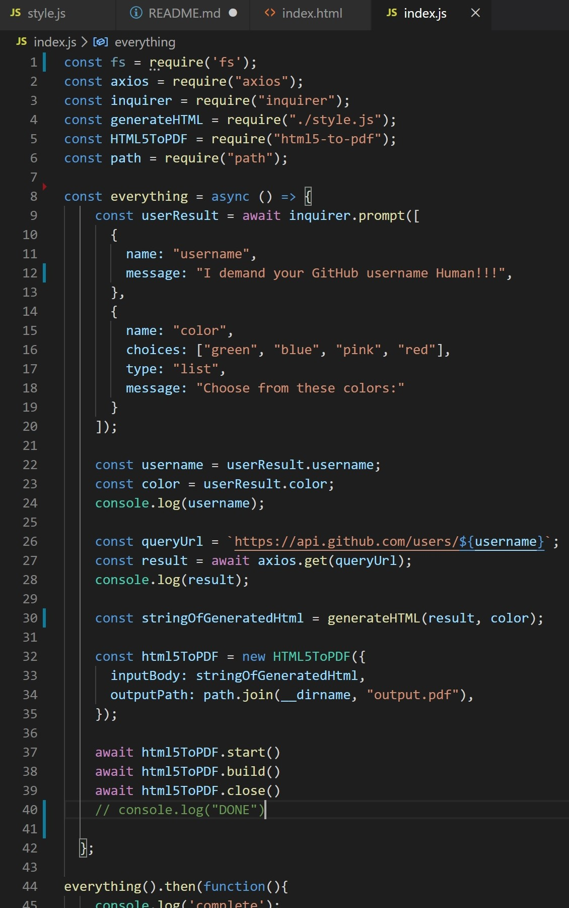
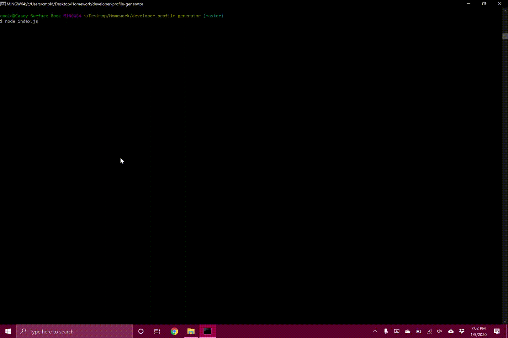

# developer-profile-generator

For this project i was responsible for writing backend code to prompt a user for their GitHub user name and give them a selection for color choices (all within the terminal). The code would then generate a pdf containing a profile populated with various bits of information from their GitHub account.
​
## Getting Started
​
To start, we students were given most of the styling css to use for our application. This was my first encountered challenge as i had to analyze that along with the provided image to determine how the html should be structured. I would have much rather done things the other way around as this took an alarming amount of time but was an interesting challenge to overcome.

images below will display what was given...

Next i tackled the greatest chellenge in the project and that was the html to pdf conversion. The function would consist of the styling (css) and the html coding. This part of the project took the longest to figure out as i ended up trying multiple pdf conversion sites before landing on one that worked. My first attempt was with electron and electron-html-to. I tried everything i could think of to make it work (consulting google like never before). At one point i even set it back to an older version to match what was found in a video demo but found that it still would not comply. It was then that i cut my losses and looked into some other options (electron was my first choice as it was suggested in the readme for the project). I next tried html-to-pdf which had similar complications that i later discovered were related to windows users. I eventually landed on html5-to-pdf which worked almost instantly! To be completely transparent, this entire process took about 4 days to reach but i learned quite a bit, especially when it comes to selecting npm options. High weekly installs and frequent updates! i know, seems a little self-explained...anywho after that struggle i took a day and a half to enjoy the small victory and then proceeded on to the github API.

code for html5-to-pdf below...

This was needed to populate the profile with the users information which was obtained through a prompt given in the terminal. I learned how to do this through a class activity (number 33 of 09-NodeJS). Made some modifications here and there of course but it was pretty easy to understand once i discovered a working example. From there i followed a similar data structure provided in the styling, placing into the html and then i was about done.

Overall this project was quite challenging and time consuming but i feel that i learned a lot and im happy i had the break to work through it. Would have been quite horrible if i only had half a week.

Gif below of the full process...

## Built With
​
* [HTML](https://developer.mozilla.org/en-US/docs/Web/HTML)
* [CSS](https://developer.mozilla.org/en-US/docs/Web/CSS)
* [Javascript](https://developer.mozilla.org/en-US/docs/Web/JavaScript)
​
​
## Authors
​
* **Casey Moldavon** 
​
- [Link to Portfolio Site](https://casey-moldavon.github.io/updated-portfolio-page/)
- [Link to Github](https://github.com/casey-moldavon/developer-profile-generator)
- [Link to LinkedIn](https://www.linkedin.com/in/casey-moldavon-442a1761/)
​
See also the list of [contributors](https://github.com/your/project/contributors) who participated in this project.
​
## License
​
This project is licensed under the MIT License 
​
## Acknowledgments
​
* Big thanks to Christopher Melby and Andres Felipe Jimenez whom both helped me out a great deal during the holiday break. We met up multiple times to study and work through problems, often related to this project.